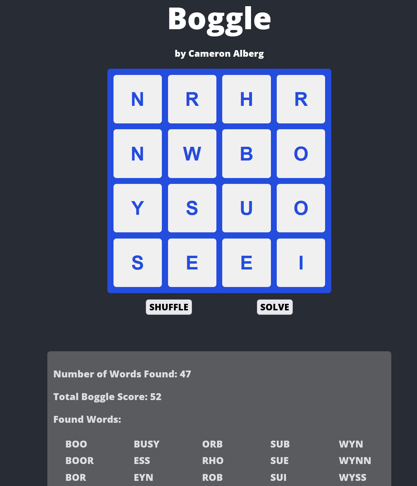

# Boggle Solver Demo

This is an interactive frontend application to demonstrate the usage of the Boggle Solver API [here](https://github.com/cameronalberg/boggleAPI).

This application was created with React and fetches valid board configurations and solutions via the REST API.

### Getting Started

This app is available via a Docker image - the latest image can be retrieved using the following command:\
`docker pull calberg/boggle-react`

The image can be run as a container with the following command:\
`docker run -p {host_port}:3000 calberg/boggle-react`

host_port can be 3000 or another port number if 3000 is already taken.